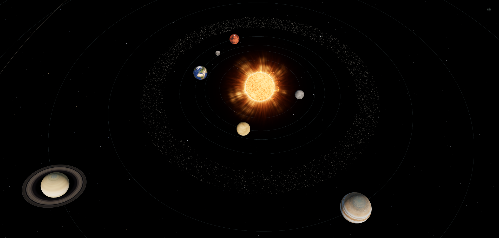

# solar-system-3d



A browser-based 3D solar system explorer built with React, Three.js, Vite, and Lucide icons. Explore textured worlds, inspect their interiors and magnetic fields, discover Mars missions, and drive a stylized Perseverance rover.

## Setup

Requires npm, a Node.js version compatible with Vite 8 (`^20.19.0 || >=22.12.0`), and a browser with WebGL 2 and hardware acceleration enabled.

```sh
npm install
npm run dev
```

Open [http://localhost:5173](http://localhost:5173), or the address printed by Vite if that port is occupied.

| Command | Action |
| --- | --- |
| `npm run dev` | Start the development server, listening on all interfaces. |
| `npm run build` | Create the production build in `dist/`. |
| `npm run preview` | Serve the production build locally, listening on all interfaces. |
| `npm test` | Run the main browser verification suite against a running server. |

## Solar system explorer

The opening overview includes the Sun, all eight planets, Pluto, the Moon beside Earth, and a procedural asteroid belt between Mars and Jupiter. Orbital paths are visible by default; names appear on hover or keyboard focus. Viewer settings can show all names or hide orbital paths.

Click or tap a world or its marker to enter a close-up view. Zooming toward a world also transitions into its close-up view when the camera approaches its surface. Zooming outward returns to the previous overview position, orientation, and zoom. That overview is retained when visiting the Moon from Earth.

Each world’s information card shows its name and classification. The details button expands its description, diameter, and distance from the Sun. The asteroid belt card shows its orbital region instead of a diameter. Pluto’s details also describe its orbit and surface-map coverage. Earth includes a **Visit the Moon** button.

### Viewer controls

| Input | Action |
| --- | --- |
| Left-click or tap a world or marker | Open its close-up view. |
| Right-drag or one-finger drag | Orbit the camera. |
| Middle-drag | Pan the camera. |
| Scroll | Zoom toward the point under the cursor; zoom outward from a world to return to the overview. |
| Pinch | Zoom toward the midpoint between two fingers. |
| **Solar system** button or `Home` | Return to the overview. |
| `Escape` | Close an open mission card first, then viewer settings, or return to the overview. |
| `R` | Reset the current camera view. |

The settings button in the top right provides **Orbital paths**, **Planet names**, **Reset view**, and **Full screen**. Full screen depends on browser support.

### Surface and sky

Worlds use locally stored surface or cloud-top textures. Earth has a separate cloud layer, Saturn has textured rings, and Pluto uses a New Horizons color mosaic with unmapped southern regions displayed in plain gray.

The Sun has an animated gold-orange photosphere with granular plasma detail and limb shading, a white-gold glowing edge, a turbulent amber corona, soft streamers that emerge, expand, and fade at changing locations, and flowing arched prominences with independent lifetimes. A broad optical halo fades smoothly into space. The corona follows the projected limb when zooming and is hidden in the Sun’s interior view. These effects use procedural shaders and instanced ribbons without full-screen postprocessing.

The sky has a black background and three procedural star layers with silver, pale-blue, and ivory stars. The layers respond to camera navigation and subtle pointer movement. Pointer-driven star motion respects the reduced-motion preference. The viewer does not load a sky background image.

### Interiors

The Sun, every planet, Pluto, and the Moon provide **Surface** and **Interior** views. Interior mode removes one hemisphere and reveals a radius-scaled cut face with distinct rock, metal, ice, fluid, and plasma patterns. Right-drag or swipe to inspect it; click a visible region or use the numbered layer list to highlight it and read its physical state, evidence, and extent. One matching callout identifies the selected region. Hatching marks possible regions and soft edges mark gradual transitions. Colors and motion are illustrative, not measured temperature or flow. Each interior includes model notes and scientific source links.

| World | Interior layers, from outside inward |
| --- | --- |
| Sun | Convection zone, radiative zone, fusion core |
| Mercury | Crust, silicate mantle, metallic outer core, possible solid inner core |
| Venus | Crust, rocky mantle, iron-rich core |
| Earth | Crust, mantle, liquid outer core, solid inner core |
| Mars | Compare inner-core and basal-melt interpretations: crust, mantle, liquid metallic core, and either a possible inner core or possible basal silicate melt layer |
| Jupiter | Molecular hydrogen, metallic hydrogen, dilute core |
| Saturn | Molecular hydrogen, metallic hydrogen, diffuse heavy-element core |
| Uranus | Hydrogen and helium envelope, hot mixed interior, possible rock-rich center |
| Neptune | Hydrogen and helium envelope, hot mixed interior, possible rock-rich center |
| Pluto | Water-ice shell, possible subsurface ocean, rocky core |
| Moon | Crust, mantle, possible partial-melt zone, liquid outer core, solid inner core |

The asteroid belt has no interior view.

### Magnetic fields

Magnetic fields are available for the Sun, all eight planets, and the Moon. The field switch works independently of the interior view, and the camera adjusts to fit the field. Each view includes an explanation and a source link.

| World | Field visualization |
| --- | --- |
| Sun | Local solar magnetic loops |
| Mercury | Offset global field |
| Venus | Induced field draping around the atmosphere |
| Earth | Tilted global dipole |
| Mars | Localized crustal fields |
| Jupiter | Global dipole |
| Saturn | Global field aligned with the rotation axis |
| Uranus | Strongly tilted, off-center field |
| Neptune | Tilted, off-center field |
| Moon | Localized crustal fields |

Fields use animated cyan, violet, and pink strands with a soft glow. Pluto and the asteroid belt have no magnetic-field control.

## Mars missions

Mars’s surface view includes seven selectable mission markers and a mission list. Selecting a mission turns Mars toward its location, including locations on the far side. Markers follow the rotating surface and are hidden behind the globe or in Interior view. Selecting a mission from Interior view restores the surface.

| Mission | Type | Mission area shown |
| --- | --- | --- |
| Perseverance | Rover | Jezero crater and western rim |
| Curiosity | Rover | Gale crater and Mount Sharp |
| Zhurong | Rover | Southern Utopia Planitia |
| Ingenuity | Helicopter | Valinor Hills, Jezero crater |
| InSight | Lander | Western Elysium Planitia |
| Opportunity | Rover | Perseverance Valley, Endeavour crater |
| Spirit | Rover | Troy, Columbia Hills, Gusev crater |

Each mission card contains an official image and credit, agency, mission type, stored status, description, achievements, arrival date, mission area, approximate coordinates, and links to mission and location references. Closing a card restores keyboard focus to its trigger.

Locations are rounded mission areas, without live telemetry. Mission information is bundled with the app and does not update automatically.

## Perseverance driving demo

Open **Mars → Perseverance → Play as Perseverance** to enter the third-person driving demo.

The scene includes a stylized six-wheel rover, rolling terrain, rocks, distant ridges, shadows, wheel tracks, and dust. The following camera moves with the rover. Rocks and the edge of the driving area block movement and display a notice. The HUD shows speed in meters per second and total distance travelled in meters.

| Input | Action |
| --- | --- |
| `W` / `S` | Drive forward / reverse. |
| `A` / `D` | Steer left / right while moving. |
| On-screen W/A/S/D buttons | Hold to drive and steer with pointer or touch input. |
| Pause / resume button | Pause or resume driving. |
| `R` or reset button | Reset the rover, distance, tracks, and dust. |
| `Escape`, `Home`, or **Back to Mars** | Return to the Perseverance mission card. |

Driving pauses when the browser tab becomes hidden. The landscape is illustrative and driving uses an arcade model.

## Scale and scientific scope

Orbital positions are fixed and illustrative. The app has no orbital clock or time-speed controls. Worlds rotate continuously as a visual animation.

Overview body sizes are enlarged, orbital spacing uses a square-root distance mapping, and the Moon’s size and separation from Earth are exaggerated. Close-up views use physical radii with one scene unit equal to 1,000 km. Bodies are spherical, and the asteroid belt is procedural rather than a catalog of individual asteroids.

The major planets have simplified circular orbital paths. Pluto’s path includes approximately 17.2° inclination and 0.249 eccentricity, with radial compression applied to its orbit. Its modeled distance spans about 29.7–49.3 AU, with its closest approach slightly inside Neptune’s orbit. Orbital phases and orientations do not represent a current ephemeris.

Interior boundaries are approximate and their evidence varies by body. Earth’s major seismic regions are well constrained; Venus’s core state and the ice giants’ deep composition remain unresolved. Mars offers separate inner-core and basal-melt interpretations, whose compatibility remains unsettled in a 2026 review. Mercury’s inner core, the Moon’s basal partial-melt zone, and Pluto’s ocean are marked as possible. Gas-giant cores use gradual heavy-element gradients. See the [body-by-body scientific review and diagram choices](docs/interior-science.md), checked against NASA, USGS, and research literature on 3 October 2026.

Magnetic fields are schematic diagrams with compressed extents. Their colors, brightness, particle motion, tilts, and geometry are not measured field maps or quantitative representations. Star positions are also illustrative.

Body dimensions are referenced to [NASA’s planet sizes and locations](https://science.nasa.gov/solar-system/planet-sizes-and-locations-in-our-solar-system/). Interior and magnetic-field references are linked within the app.

## Assets and attribution

- **Planet, Moon, Sun, cloud, and ring maps:** [Solar System Scope / INOVE](https://www.solarsystemscope.com/textures/), licensed [CC BY 4.0](https://creativecommons.org/licenses/by/4.0/), based on NASA and spacecraft imagery. Maps include enhanced colors and reconstructed coverage gaps; gas and ice giant maps show cloud tops. The Sun map is animated and color-treated in the app, and Saturn’s ring map uses radial texture coordinates.
- **Pluto:** [NASA/JHUAPL/SwRI New Horizons global color mosaic](https://science.nasa.gov/resource/pluto-global-color-map/), resized to 2048 × 1024. Resolution varies across the mosaic; unmapped regions appear as neutral gray.
- **Mars mission images:** NASA/JPL-Caltech, MSSS, Cornell/ASU, and CNSA, as credited on each mission card. Local WebP files, image credits, and original source links are documented in [public/robots/ATTRIBUTION.md](public/robots/ATTRIBUTION.md).
- **Texture records:** [public/textures/ATTRIBUTION.txt](public/textures/ATTRIBUTION.txt) includes sources, licenses, modifications, and archived sky assets. Those archived sky images are not used by the current viewer.
- **Fonts:** Google Fonts supplies DM Sans and Manrope when available; the app falls back to sans-serif offline. Textures and mission images are served locally.

## Browser verification

Start the development server in a separate terminal before running any of the browser suites. The default target is `http://localhost:5173`.

| Command | Coverage |
| --- | --- |
| `npm test` | Overview, fixed positions, cursor-directed zoom, close-up transitions, camera restoration, rotation, interiors, magnetic fields, Moon and asteroid belt navigation, settings, and mobile layouts. |
| `node tests/interiors.mjs` | All interior models, rendered five-layer Moon, material animation, layer picking, Mars interpretations, selected callouts, and mobile layout. |
| `node tests/sun.mjs` | Rendered corona brightness and color falloff, streamer emergence and fading at different angles, animation, zoom/orbit alignment, interior visibility, and mobile rendering. |
| `node tests/pluto.mjs` | Pluto’s orbit geometry, surface texture, interior, mobile visibility, and overview return. |
| `node tests/overview-return.mjs` | Camera restoration after scroll approaches, the rover demo, and mobile interior and field views. |
| `node tests/mars-robots.mjs` | All seven mission markers and cards, coordinates, far-side selection, interior behavior, and mobile layout. |
| `node tests/rover-demo.mjs` | Driving physics, controls, collisions, boundaries, pause/reset, touch controls, and return navigation. |

`npm test` runs only the main viewer suite; run the other commands separately for their coverage. Suites use Playwright and default to Chrome at `/opt/google/chrome/chrome`. Set `CHROME_PATH` to another executable, or install Playwright’s Chromium:

```sh
npx playwright install chromium
CHROME_PATH=playwright npm test
```

Set `BASE_URL` to test a different server address. Screenshot-producing suites save their output in `.test-artifacts/`.

## Source layout

| File | Contents |
| --- | --- |
| `src/App.jsx` | Information cards, mission dialogs, settings, and navigation. |
| `src/Scene.jsx` | Solar system rendering, camera navigation, selection, and scene integration. |
| `src/data.js` | Body descriptions and physical data. |
| `src/orbits.js` | Orbital positions and overview distance mapping. |
| `src/InteriorCutaway.js`, `src/InteriorCallout.js`, `src/interiors.js` | Cutaway rendering, selected-layer labels, layer models, and references. |
| `docs/interior-science.md` | Dated scientific review, sources, and diagram assumptions. |
| `src/MagneticField.js`, `src/magneticFields.js` | Animated field rendering, models, and references. |
| `src/SolarCorona.js`, `src/Starfield.js` | Solar corona and procedural sky. |
| `src/MarsRobotMarkers.js`, `src/marsRobots.js` | Mars markers, mission data, image credits, and references. |
| `src/RoverDemo.jsx`, `src/PerseveranceRover.js`, `src/marsDriving.js` | Driving scene, rover model, terrain, and movement. |
| `src/style.css` | Viewer styling and responsive layouts. |
| `public/textures/`, `public/robots/` | Local visual assets and attribution records. |
| `tests/` | Browser verification suites. |
